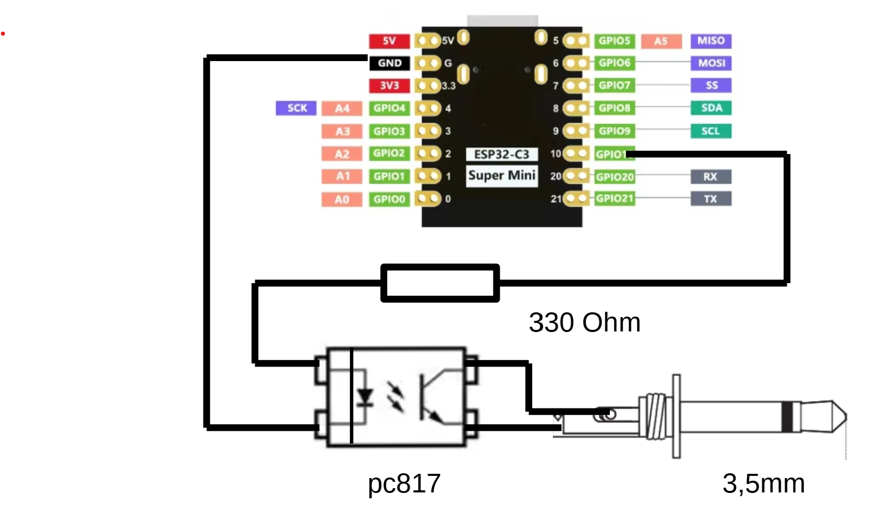

# Tacx Trainer Cadence Sensor Pulse Generator

This Arduino program is designed to generate cadence pulses required for operating the Tacx bike trainer from the cadence sensor of your bicycle. The generated cadence pulses are output through a cable with a jack plug.

## Features

- Connects to a Bluetooth Low Energy (BLE) cadence sensor.
- Monitors the sensor for cadence data.
- Generates cadence pulses based on the revolutions detected.
- Outputs cadence pulses on GPIO10.
- Provides visual feedback with a built-in LED.
- Long press functionality to reset the sensor.

## Pin Configuration

- **GPIO9**: Boot button (PROG button)
- **GPIO10**: Cadence output (to jack plug)
- **Built-in LED**: Provides visual feedback

## Requirements

- Arduino IDE
- ArduinoBLE library
- Compatible Arduino board (e.g., Arduino Nano 33 BLE/ ESP32-C3 Super Mini)

## Installation

1. Install the ArduinoBLE library via the Library Manager in the Arduino IDE.
2. Upload the provided sketch to your Arduino board.
3. Connect the cadence sensor to power on it and ensure it is within range.

## Usage

1. Power on the cadence sensor.
2. Upload the sketch to the Arduino.
3. The built-in LED will blink while scanning for the sensor.
4. When the sensor is found, the LED will turn off, and the program will start monitoring cadence data.
5. Cadence pulses will be generated and sent to GPIO10, along with visual feedback from the LED.

## Conclusion

This program allows you to effectively interface with a cadence sensor for the Tacx trainer, providing the necessary cadence pulses
